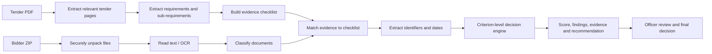

# Pramaan / GeM Compliance Platform — Team Workflow

## 1. Product goal

Pramaan assists a procurement officer with tender and bidder-document review.
It extracts requirements, checks submitted evidence, identifies exceptions,
explains the evidence behind each result, and recommends a review outcome.
The procurement officer always makes the final decision.

## 2. End-to-end workflow



### Normal tender and bidder flow

1. Officer uploads a tender PDF.
2. Backend selects relevant pages and extracts requirements.
3. Requirements include parent requirements, sub-requirements, conditions,
   thresholds, evidence types and source-page excerpts.
4. Officer reviews the generated checklist and can include or exclude items.
5. Officer uploads the bidder ZIP.
6. Backend safely unpacks nested ZIPs and reads PDF, image, DOCX and text files.
7. Documents are classified and matched to checklist items.
8. Identifiers such as GSTIN, PAN, TAN, CIN, UDYAM and dates are extracted.
9. The shared decision engine returns the score, missing or review items,
   explanations, evidence and a recommendation.
10. The officer reviews the evidence and makes the final decision.

### JSON scenario flow

JSON is an acceptance-test format, not bidder evidence. Upload scenario JSON to
exercise criterion-level validation without creating a ZIP of fake documents.
The adapter normalizes scenario facts into the same shared decision engine used
by the real-file pipeline.

## 3. Current repository structure

```text
gem-compliance-platform/
├── dev.sh                              # starts frontend and backend together
├── TEAM_WORKFLOW.md                    # this document
├── backend/
│   ├── requirements.txt                # Python dependencies
│   └── app/
│       ├── main.py                     # FastAPI app and CORS configuration
│       ├── api/routes/compliance.py    # HTTP endpoint definitions
│       ├── schemas/compliance.py       # request/response data models
│       └── services/extractor/
│           ├── api_pipeline.py         # upload-to-pipeline orchestration
│           ├── tender_pipeline.py      # tender PDF page extraction/ranking
│           ├── llm_extract.py          # LLM requirement extraction
│           ├── req.py                  # requirement models
│           ├── checklist_build.py      # requirements -> evidence checklist
│           ├── bidder_zip.py           # ZIP safety and document text extraction
│           ├── document_classifier.py  # bidder-document classification
│           ├── doc_check.py            # checklist reconciliation
│           ├── match_engine.py         # evidence matching
│           ├── field_extraction.py     # GSTIN/PAN/TAN/CIN/Udyam/date extraction
│           ├── compliance_score.py     # legacy report scoring helpers
│           ├── criterion_engine.py     # shared decision and score engine
│           ├── scenario_json.py        # structured JSON scenario adapter
│           └── test_pipeline.py        # backend unit/integration tests
└── frontend-temp/
    ├── package.json                    # Astro scripts and dependencies
    ├── .env.example                    # backend URL example
    └── src/
        ├── pages/app/extract.astro     # connected tender-analysis workflow
        ├── pages/app/                  # remaining dashboard pages
        ├── components/                 # shared UI components
        ├── layouts/                    # shared layouts
        └── styles/                     # application styling
```

## 4. API contract

All routes use the `/api/compliance` prefix.

| Endpoint | Input | Purpose |
|---|---|---|
| `POST /tenders/context` | Tender PDF | Return selected pages and extracted context |
| `POST /tenders/requirements` | Tender PDF, optional model | Extract requirements and sub-requirements |
| `POST /checklists` | Requirements JSON | Convert reviewed requirements into a checklist |
| `POST /bidders/extract` | Bidder ZIP | Extract bidder files and text |
| `POST /match` | Bidder ZIP and checklist JSON | Match submitted evidence to a checklist |
| `POST /pipeline` | Tender PDF, bidder ZIP, optional reviewed requirements | Run the complete real-file pipeline |
| `POST /scenarios/evaluate` | Scenario JSON | Run structured acceptance-test data |

The frontend should normally use `/tenders/requirements` first so the officer
can review the checklist, followed by `/pipeline` with the reviewed requirements
and bidder ZIP. It should use `/scenarios/evaluate` only for test scenarios.

## 5. Running locally

### First-time setup

```bash
cd /path/to/gem-compliance-platform

python3 -m venv backend/.venv
backend/.venv/bin/pip install -r backend/requirements.txt

cd frontend-temp
npm install
cp .env.example .env
cd ..
```

An optional local Ollama model can improve tender requirement extraction. If it
is unavailable, the backend uses its conservative rule-based fallback.

### Start both services

```bash
./dev.sh
```

- Website: `http://127.0.0.1:4321/app/extract`
- API documentation: `http://127.0.0.1:8000/docs`
- Stop both services: `Ctrl+C`

## 6. Verification before sharing a change

Run backend tests:

```bash
PYTHONPATH=backend backend/.venv/bin/python -m unittest -v \
  app.services.extractor.test_pipeline
```

Build the frontend:

```bash
cd frontend-temp
npm run build
```

A change is ready for review only when:

- backend tests pass;
- the frontend build passes;
- no sample or mock result overlaps live pipeline output;
- every compliance result includes a reason and evidence reference;
- missing, failed and review-required states remain distinct;
- AI recommendations are not presented as the officer's final decision;
- new request/response fields are reflected in schemas, API handling and UI;
- new behavior has at least one passing and one failing test case.

## 7. Suggested ownership

| Workstream | Primary responsibility |
|---|---|
| Tender intelligence | Requirement extraction, sub-requirements, clauses, thresholds and page evidence |
| Document intelligence | ZIP ingestion, OCR, classification and field extraction |
| Compliance engine | Criterion normalization, scoring, findings and explanations |
| Integrations | Authorized-source verification connectors and audit-safe responses |
| Frontend | Upload/review workflow, results dashboard and evidence presentation |
| Quality | Scenario fixtures, real-file test packs, regression tests and security checks |

Keep endpoint schemas and normalized criterion states as shared contracts. A
workstream may change its internal implementation without forcing other teams
to rewrite their code if those contracts remain stable.

## 8. Git collaboration

1. Pull the latest shared branch before starting.
2. Create a small branch such as `feature/gstin-validation` or
   `fix/tender-threshold-parsing`.
3. Keep each pull request focused on one workstream or contract change.
4. Do not commit `.env`, bidder files, tender files, extracted document text,
   virtual environments, `node_modules`, build output or credentials.
5. If an API schema changes, include backend tests and the matching frontend
   update in the same pull request or coordinate paired pull requests.
6. Include test commands, sample input type and observed output in the pull
   request description.
7. Require review from the owner of every affected shared contract.

## 9. Current capability boundaries

Working today:

- tender PDF text extraction and relevant-page selection;
- LLM extraction with a conservative heuristic fallback;
- parent requirements, sub-requirements, conditions and thresholds;
- bidder ZIP ingestion, nested ZIP safety, document reading and OCR attempts;
- deterministic document classification and checklist matching;
- identifier/date extraction with evidence excerpts;
- exact custom-evidence filename matching;
- separate document-coverage and criterion-level validation scores;
- real-file threshold, identifier, expiry and cross-document consistency checks;
- shared pass/fail/review states with evidence-backed explanations;
- structured JSON acceptance scenarios;
- connected frontend upload and result workflow.

Still requiring production work:

- authorized government-source connectors for GST, PAN, Udyam and other checks;
- robust entity-name, date-expiry and cross-document consistency validation for
  every real bidder file;
- persistent cases, users, audit logs and role-based access;
- background jobs, upload limits, malware scanning and encrypted storage;
- model evaluation, monitoring and production deployment;
- broader real-tender and bidder-document regression coverage.

Until source integrations exist, extracted values must be labelled
`submitted_unverified`; they must not be shown as government-verified facts.
